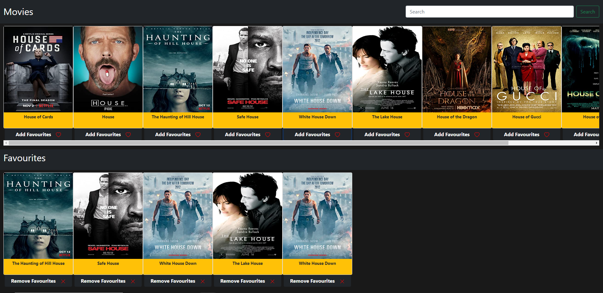

# Movie App

🔸 Search for the movies you want and add them to your favourites. <br>
🔸 This web app built with using [React](https://reactjs.org/).

## 💻 Setup <br>

### Install Dependencies

```
npm install
```

### Run the App in the Dev Server

```
npm start
```

### to Build for Production

```
npm build
```

## 🔥 Technologies and Libraries <br>

✔️ React.js <br>
✔️ Bootsrap <br>
✔️ Fetch APİ

## 📷 Screenshot <hr>


